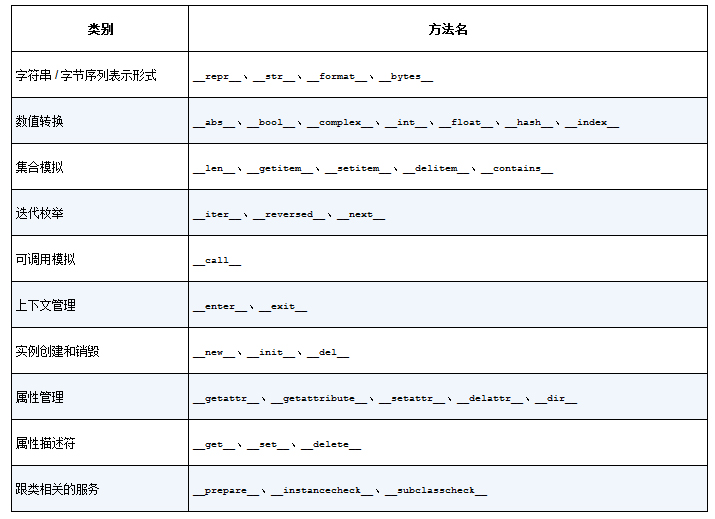

# 第一章 Python 数据类型

> Python 最好的品质之一是一致性

魔术方法（magic method）是特殊方法的昵称，特殊方法也叫双下方法（dunder method）。

示例：
```python
import collections
from random import choice
Cards = collections.namedtuple('Cards', ['rank', 'suit'])

class FrenchDeck:
    ranks = [str(n) for n in range(2,11)] + list('JQKA')
    suits = 'spades diamonds clubs hearts'.split()
    
    def __init__(self):
        self._cards = [Cards(rank, suit) for suit in self.suits for rank in self.ranks ]
    
    def __len__(self):
        return len(self._cards)

    def __getitem__(self, pos):
        return self._cards[pos]
    
    def __repr__(self):
        return str(self._cards)
        
deck = FrenchDeck()
print(len(deck), deck[2])
print(choice(deck))
print(choice(deck))
```

输出如下：
```
52 Cards(rank='2', suit='clubs')
Cards(rank='A', suit='spades')
Cards(rank='4', suit='diamonds')
```

因为__getitem__ 方法把 [] 操作交给了self._cards列表，所以我们的deck类自动支持切片（slicing）操作。切片获取纸牌 A：
```python
deck[12::13]
```

输出如下：
```
[Cards(rank='A', suit='spades'),
 Cards(rank='A', suit='diamonds'),
 Cards(rank='A', suit='clubs'),
 Cards(rank='A', suit='hearts')]
```

迭代通常是隐式的，譬如说一个集合类型没有实现 `__contains__` 方法，那么 in 运算符就会按顺序做一次**迭代搜索**。于是，in 运算符可以用在我们的FrenchDec 类上。

如果是Python 内置的类型，比如列表（list）、字符串（str）、字节序列（bytearray）等，那么CPython 会抄个近路，`__len__` 实际上会直接返回 PyVarObject里的 ob_size 属性。PyVarObject是表示内存中长度可变的内置对象的C语言结构体。直接读取这个值比调用一个方法要快很多。

在看一个例子，向量类：
```python
from math import hypot

class Vector:
    def __init__(self, x, y):
        self.x = x
        self.y = y
        
    def __repr__(self):
        return 'Vector(%r, %r)' % (self.x, self.y)
    
    def __abs__(self):
        return hypot(self.x, self.y)
    
    def __bool__(self):
        return bool(self.x or self.y)
    
    def __add__(self, obj):
        return Vector(self.x + obj.x, self.y + obj.y)
    
    def __mul__(self, scalar):
        return Vector(self.x * scalar, self.y * scalar)

print(Vector(1,2) + Vector(3,4))
print(Vector(1,2) * 4)
if not Vector(0,0):
    print("None")

print(abs(Vector(3,4)))
```

输出如下：
```
Vector(4, 6)
Vector(4, 8)
None
5.0
```

> `__repr__` 和`__str__` 的区别在于，后者是在str()函数被使用，或是在用print函数打印一个对象的时候才被调用的，并且它返回的字符串对终端用户更友好。如果你只想实现这两个特殊方法中的一个，`__repr__`是更好的选择，因为如果一个对象没有__str__函数，而Python 又需要调用它的时候，解释器会用__repr__作为替代。前者方便我们调试和记录日志，后者则是给终端用户看的。

> 默认情况下，我们自己定义的类的实例总被认为是真的，除非这个类对 `__bool__`或者 `__len__`函数有自己的实现。bool(x)的背后是调用`x.__bool__()`的结果；如果不存在`__bool__` 方法，那么 bool(x) 会尝试调用`x.__len__()`。若返回 0，则 bool 会返回 False；否则返回 True。

与运算符无关的特殊方法：
