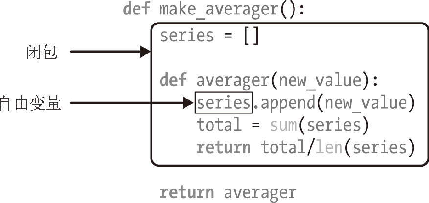

# 函数装饰器和闭包

函数装饰器用于在源码中“标记”函数，以某种方式增强函数的行为

## 装饰器基础知识
装饰器是可调用的对象，其参数是另一个函数（被装饰的函数）。 装饰器可能会处理被装饰的函数，然后把它返回，或者将其替换成另一个函数或可调用对象。


装饰器的一大特性是，能把被装饰的函数替换成其他函数。第二个特性是，**装饰器在加载模块时立即执行**。

## 装饰器何时被执行
装饰器的一个关键特性是，它们在被装饰的函数定义之后立即运行。这通常是在导入时（即 Python 加载模块时）。函数装饰器在导入模块时立即执行，而被装饰的函数只在明确调用时运行。这突出了Python 程序员所说的导入时和运行时之间的区别。

```python
print("global")

def register(func):    
    def wrapp():
        print("register")
        func()
    return wrapp

@register
def f1():
    print("f1")
    
f1()
```

输出如下：
```python
def register(func):  
    print("run register")
    def wrapped():
        print("run wrapped")
        func()
    return wrapped

def register2(func):  
    print("run register2")
    def wrapped():
        print("run wrapped")
        func()
    return wrapped

@register
def f1():
    print("run f1")

    
if __name__ == "__main__":
    print("run main")
    f1()
```

输出如下：
```python
run register
run main
run wrapped
run f1
```

我们可以发现，在运行 py 文件时，有被调用的装饰器在 main 之前就被执行。

> 实际情况是，装饰器通常在一个模块中定义，然后应用到其他模块中的函数上。

## 变量作用域规则
先看一个例子：
```python
b = 6
def f2(a):
    print(a)
    print(b)
    b = 3

f2(1)
```
输出如下：
```
1
UnboundLocalError: local variable 'b' referenced before assignment
```

Python 编译函数的定义体时，它判断 b是局部变量，因为在函数中给它赋值了。Python 会尝试从本地环境获取 b。后面调用f2(3)时， f2的定义体会获取并打印局部变量 a的值，但是尝试获取局部变量 b的值时，发现 b 没有绑定值。Python 不要求声明变量，但是假定在函数定义体中赋值的变量是局部变量。

## 闭包
闭包指延伸了作用域的函数，其中包含函数定义体中引用、但是不在定义体中定义的非全局变量

先看一个例子：
```python
def make_averager():
    series = []
    
    def averager(new_value):
        series.append(new_value)
        return sum(series) / len(series)
    return averager

avg = make_averager()

avg(1),avg(2),avg(3),avg(4) # (1.0, 1.5, 2.0, 2.5)
```
> 在averager函数中，series是自由变量（free variable）



闭包是一种函数，它会保留定义函数时存在的自由变量的绑定，这样调用函数时，虽然定义作用域不可用了，但是仍能使用那些绑定。

## nonlocal声明
先看下面这个例子：
```python
def make_averager2():
    count = total = 0
    
    def averager(new_value):
        count += 1 # UnboundLocalError: local variable 'count' referenced before assignment
        total += new_value
        return total / count
    return averager

avg = make_averager2()

avg(1),avg(2),avg(3),avg(4) # (1.0, 1.5, 2.0, 2.5)
```

由于 averager 中的 count 进行了重新复制，编译时会将count识别为局部变量，而不是自由变量，从而报错。

引入 nonlocal，它的作用是把变量标记为自由变量，即使在函数中为变量赋予新值了，也会变成自由变量。如果为nonlocal 声明的变量赋予新值，闭包中保存的绑定会更。更新后的代码如下：
```python
def make_averager2():
    count = total = 0
    
    def averager(new_value):
        nonlocal count, total
        count += 1
        total += new_value
        return total / count
    return averager

avg = make_averager2()

avg(1),avg(2),avg(3),avg(4) # (1.0, 1.5, 2.0, 2.5)
```

输出正常。

## 一个记录函数耗时的装饰器
代码如下：
```python
import time
import functools
def clock(func):
    @functools.wraps(func)
    def clocked(*args, **kwargs):
        t0 = time.time()
        result = func(*args, **kwargs)
        elapsed = time.time() - t0
        name = func.__name__
        arg_lst = []
        if args:
            arg_lst.append(', '.join(repr(arg) for arg in args))
        if kwargs:
            pairs = ['%s=%r' % (k, w) for k, w in sorted(kwargs.items())]
            arg_lst.append(', '.join(pairs))
        arg_str = ', '.join(arg_lst)
        print('[%0.8fs] %s(%s) -> %r ' % (elapsed, name, arg_str, result))
        return result
    return clocked

@clock
def func(a, *b, c=20, **d):
    e = 10
    print(a, b, c, d)
    
func(1, 2, 3, c=10, e=11, f=12)
```

输出如下：
```
1 (2, 3) 10 {'e': 11, 'f': 12}
[0.00040603s] func(1, 2, 3, c=10, e=11, f=12) -> None 
```

## 标准库中的装饰器

### 使用functools.lru_cache做备忘
`functools.lru_cache`是非常实用的装饰器，它实现了备忘（memoization）功能。这是一项优化技术，它把耗时的函数的结果保存起来，避免传入相同的参数时重复计算。LRU 三个字母是“Least Recently Used”的缩写，表明缓存不会无限制增长，一段时间不用的缓存条目会被扔掉。

```python
from functools import lru_cache

@lru_cache(maxsize=128, typed=False)
@clock
def fact(n):
    return n if n < 2 else fact(n-2) + fact(n-1)

fact(10)
```

输出如下：
```
[0.00000095s] fact(0) -> 0 
[0.00000048s] fact(1) -> 1 
[0.00023150s] fact(2) -> 1 
[0.00000095s] fact(3) -> 2 
[0.00028586s] fact(4) -> 3 
[0.00000048s] fact(5) -> 5 
[0.00033927s] fact(6) -> 8 
[0.00000095s] fact(7) -> 13 
[0.00040603s] fact(8) -> 21 
[0.00000048s] fact(9) -> 34 
[0.00045896s] fact(10) -> 55 
```
而如果不添加 lru_cache 的装饰器，则有相当多重复进入的情况。

maxsize 参数指定存储多少个调用的结果。缓存满了之后，旧的结果会被扔掉，腾出空间。为了得到最佳性能，maxsize 应该设为2的幂。typed 参数如果设为True，把不同参数类型得到的结果分开保存，即把通常认为相等的浮点数和整数参数（如1和1.0）区分开。顺便说一下，因为lru_cache使用字典存储结果，而且键根据调用时传入的定位参数和关键字参数创建，所以被lru_cache 装饰的函数，它的所有参数都必须是可散列的。

### singledispatch

```python
from functools import singledispatch

@singledispatch
def show(obj):
    return "obj " + repr(obj)

@show.register(str)
def _(text):
    return "str " + repr(text)

@show.register(int)
def _(n):
    return "int " + str(n)

print(show(1))
print(show('1'))
print(show([1]))
```

输出如下：
```
int 1
str '1'
obj [1]
```

singledispatch 机制的一个显著特征是，你可以在系统的任何地方和任何模块中注册专门函数。如果后来在新的模块中定义了新的类型，可以轻松地添加一个新的专门函数来处理那个类型。此外，你还可以为不是自己编写的或者不能修改的类添加自定义函数。

## 参数化装饰器

归根结底是创建一个装饰器工厂

```python
import time
import functools
def clock(need_args=True):
    def wrapper(func):
        @functools.wraps(func)
        def clocked(*args, **kwargs):
            t0 = time.perf_counter()
            result = func(*args, **kwargs)
            elapsed = time.perf_counter() - t0
            name = func.__name__
            if need_args:
                arg_lst = []
                if args:
                    arg_lst.append(', '.join(repr(arg) for arg in args))
                if kwargs:
                    pairs = ['%s=%r' % (k, w) for k, w in sorted(kwargs.items())]
                    arg_lst.append(', '.join(pairs))
                arg_str = ', '.join(arg_lst)
                print('[%0.8fs] %s(%s) -> %r ' % (elapsed, name, arg_str, result))
            else:
                print('[%0.8fs] %s -> %r ' % (elapsed, name, result))
            return result
        return clocked
    return wrapper

#@clock() 此处的装饰器必须带括号，即使不传任何参数，因为这是一个装饰器工厂，调用返回的才是一个装饰器。
@clock(need_args=False)
def func(a, *b, c=20, **d):
    e = 10
    print(a, b, c, d)
    
func(1, 2, 3, c=10, e=11, f=12)
```

