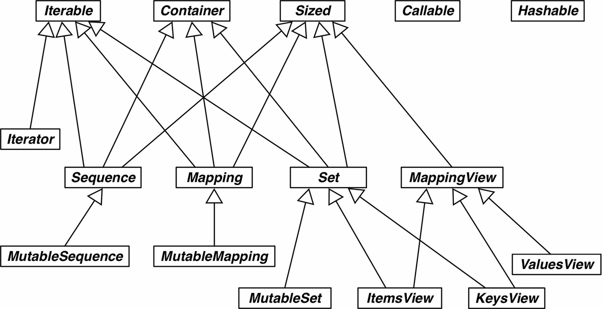

# 接口：从协议到抽象基类

先看下面这个例子：
```python
class Foo:
    def __getitem__(self, pos):
        return range(0, 30, 10)[pos]
    
f = Foo()
print(f[1])

for i in f:
    print(i)

print(20 in f)
print(15 in f)
```

输出如下：
```
10
0
10
20
True
False
```

虽然没有 `__iter__` 方法，但是Foo 实例是可迭代的对象，因为发现有 `__getitem__` 方法时，Python 会调用它，传入从0开始的整数索引，尝试迭代对象（这是一种后备机制）。尽管没有实现 `__contains__` 方法，但是Python 足够智能，能迭代Foo 实例，因此也能使用in 运算符：Python 会做全面检查，看看有没有指定的元素。综上，鉴于序列协议的重要性，如果没有 `__iter__`和 `__contains__` 方法，Python 会调用 `__getitem__`方法，设法让迭代和in 运算符可用。

## 使用猴子补丁在运行时实现协议
猴子补丁：在运行时修改类或模块，而不改动源码。猴子补丁很强大，但是打补丁的代码与要打补丁的程序耦合十分紧密，而且往往要处理隐藏和没有文档的部分。

```python
import random
import collections

Cards = collections.namedtuple('Cards', ['rank', 'suit'])
class FrenchDeck:
    ranks = [str(n) for n in range(2,11)] + list('JQKA')
    suits = 'spades diamonds clubs hearts'.split()
    
    def __init__(self):
        self._cards = [Cards(rank, suit) for suit in self.suits for rank in self.ranks ]
    
    def __len__(self):
        return len(self._cards)

    def __getitem__(self, pos):
        return self._cards[pos]
    
    def __repr__(self):
        return str(self._cards)

def set_card(deck, position, card):
    deck._cards[position] = card
FrenchDeck.__setitem__ = set_card # 猴子补丁
f = FrenchDeck()
random.shuffle(f)
```

如果不添加猴子补丁，则在 shuffle 时会报错：`TypeError: 'FrenchDeck' object does not support item assignment`，原因是没有实现可变序列特殊方法 `__setitem__`。


> "鸭子类型"：对象的类型无关紧要，只要实现了特定的协议即可

## 标准库中的抽象基类
大多数抽象基类在collections.abc 模块中定义
### collections.abc模块中的抽象基类
Python 3.4在collections.abc  模块中定义了16个抽象基类，简要的UML类图 如下图



**Iterable、Container 和 Sized**
各个集合应该继承这三个抽象基类，或者至少实现兼容的协议。Iterable 通过 `__iter__` 方法支持迭代，Container 通过 `__contains__` 方法支持 `in` 运算符，Sized 通过 `__len__` 方法支持 `len()`函数。

**Sequence、Mapping 和 Set**
这三个是主要的不可变集合类型，而且各自都有可变的子类。

**MappingView**
在Python 3中，映射方法 .items()、.keys()和.values() 返回的对象分别是ItemsView、KeysView和ValuesView的实例。前两个类还从Set类继承了丰富的接口。

**Callable 和 Hashable**
这两个抽象基类与集合没有太大的关系，只不过因为collections.abc是标准库中定义抽象基类的第一个模块，而它们又太重要了，因此才把它们放到collections.abc 模块中。我从未见过Callable或Hashable的子类。这两个抽象基类的主要作用是为内置函数 isinstance 提供支持，以一种安全的方式判断对象能不能调用或散列。

**Iterator**
它是Iterable 的子类。

### 定义并使用一个抽象基类
```python
import abc

class Tombola(abc.ABC):
    @abc.abstractmethod
    def load(self, iterable):
        """从可迭代对象中添加元素。"""
    @abc.abstractmethod
    def pick(self):
        """随机删除元素，然后将其返回。如果实例为空，这个方法应该抛出`LookupError`。"""
    def loaded(self):
        return bool(self.inspect())

    def inspect(self):
        items = []
        while True:
            try:
                items.append(self.pick())
            except LookupError: # IndexError 和 KeyError 的父类
                break
        self.load(items)
        return tuple(sorted(items))
```
抽象方法可以有实现代码。即便实现了，子类也必须覆盖抽象方法，但是在子类中可以使用super()函数调用抽象方法，为它添加功能，而不是从头开始实现。inspect() 方法实现的方式有些笨拙，不过却表明，有了.pick()和.load(…) 方法，若想查看Tombola中的内容，可以先把所有元素挑出，然后再放回去。Tombola的具体子类知晓内部数据结构，可以覆盖 .inspect() 方法，使用更聪明的方式实现，但这不是强制要求。


### 继承抽象基类
```python
import random

class LotteryBlower(Tombola):
    def __init__(self, iterable):
        self._balls = list(iterable)
    
    def load(self, iterable):
        self._balls.extend(iterable)
        
    def pick(self):
        try:
            position = random.randrange(len(self._balls))
        except ValueError:
            raise LookupError('pick from emppty LotteryBlower')
        return self._balls.pop(position)
    def loaded(self):
        return bool(self._balls)
    def inspect(self):
        return tuple(sorted(self._balls))
```

### Tombola的虚拟子类
即便不继承，也有办法把一个类注册为抽象基类的虚拟子类。这样做时，我们保证注册的类忠实地实现了抽象基类定义的接口，而Python 会相信我们，从而不做检查。如果我们说谎了，那么常规的运行时异常会把我们捕获。

注册虚拟子类的方式是在抽象基类上调用register 方法。这么做之后，注册的类会变成抽象基类的虚拟子类，而且 issubclass和isinstance 等函数都能识别，但是注册的类不会从抽象基类中继承任何方法或属性。

> 虚拟子类不会继承注册的抽象基类，而且任何时候都不会检查它是否符合抽象基类的接口，即便在实例化时也不会检查。为了避免运行时错误，虚拟子类要实现所需的全部方法。

```python
from random import randrange

@Tombola.register
class TomboList(list):
    def pick(self):
        if self:
            position = randrange(self)
            return self.pop(position)
        else:
            raise LookupError('pop from empty TomboList')
    load = list.extend
    
    def loaded(self):
        return bool(self)
    def inspect(self):
        return tuple(sorted(self))
```
> 类的继承关系在一个特殊的类属性中指定—— `__mro__` ，即方法解析顺序（Method ResolutionOrder）`Tombolist.__mro__` 中没有Tombola，因此 Tombolist 没有从Tombola中继承任何方法。

